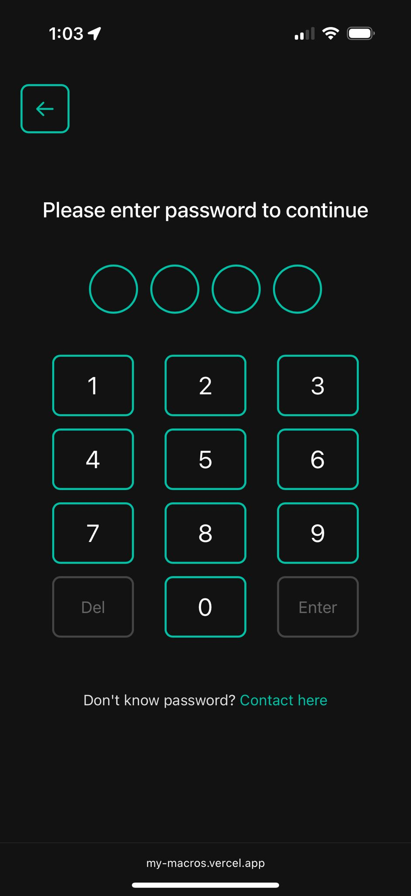

# My Macros App

## 😇 Motivation
I love to track my calories to make sure I am always on the right track for my fitness journey but fortunately, I have a life so I can't always track every bit when I am out for a bite with my friends. Then, I usually would snap a photo of the meal and always ask AI to estimate the macros. The steps are a bit mundane and reptitve to me so that's when I decided to write myself a nifty little web app where I can open, snap a photo and get my macros right away. The app is delpoyed [here](https://my-macros.vercel.app/) but you will not be able to scan it because the password is not visible. You can contact me if you want to see how it works!

---

## 🚀 Overview

My Macros App allows users to upload food images and receive detailed macronutrient estimates — calories, protein, carbs, and fat — along with a list of identified ingredients. Users must enter a secure PIN to access the image upload functionality.

---

## 🧱 Architecture
# My Macros App - Backend API

This is the backend service for My Macros App, which estimates macronutrients from food images using the Claude 3 API. This document provides comprehensive information for frontend developers to integrate with this API.

## API Endpoints

### Password Verification
```
POST /api/verify
```
Verifies the user-provided password to grant access to the application.

**Request Body:**
```json
{
  "password": "string"
}
```

**Responses:**
- `200 OK`: Password verified successfully
  ```json
  {
    "status": 200,
    "message": "Authentication successful"
  }
  ```
- `400 Bad Request`: Password missing
  ```json
  {
    "status": 400,
    "error": "Password is required"
  }
  ```
- `401 Unauthorized`: Incorrect password
  ```json
  {
    "status": 401,
    "error": "Invalid password"
  }
  ```

### Food Image Analysis
```
POST /api/estimate
```
Analyzes a food image to estimate macronutrients and identify ingredients.

**Request Body:**
- Format: `multipart/form-data`
- Fields:
  - `image`: The food image file (JPEG, PNG)
  - `mode`: Analysis mode - `basic` or `detailed` (optional, defaults to `basic`)

**Responses:**
- `200 OK`: Analysis completed successfully (even if no food detected)
  
  When food is detected:
  ```json
  {
    "calories": "540",
    "protein": "30g",
    "carbs": "45g",
    "fat": "22g",
    "ingredients": ["grilled chicken", "rice", "broccoli"]
  }
  ```
  
  When no food is detected:
  ```json
  {
    "calories": null,
    "protein": null,
    "carbs": null,
    "fat": null,
    "ingredients": null,
    "message": "No edible food detected in the image"
  }
  ```

- `400 Bad Request`: Invalid request (missing image, invalid mode)
- `413 Payload Too Large`: Image file exceeds size limit (5MB by default)
- `502 Bad Gateway`: Error communicating with Claude API

### Health Check
```
GET /health
```
Simple endpoint to verify the API is running.

**Response:**
```json
{
  "status": "ok",
  "timestamp": "2025-05-20T12:00:00.000Z",
  "env": "production"
}
```

### API Documentation
```
GET /docs
```
Interactive Swagger documentation for exploring all endpoints (available in development environment only).

**Note:** The Swagger UI is only available when running the backend locally in development mode. In production, refer to this README for API details.

## Integration Guide for Frontend Developers

### Authentication Flow

1. When your app first loads, you should show a password input screen
2. The password is 4-digit PIN: `2911` (in production, this is stored as an environment variable, which is changed **obviously later**)
3. Send the entered password to the `/api/verify` endpoint
4. If successful, proceed to the main app; otherwise, show an error message

Example frontend code (React):
```javascript
const verifyPassword = async (password) => {
  try {
    const response = await fetch('https://backend-mymacros.vercel.app/api/verify', {
      method: 'POST',
      headers: {
        'Content-Type': 'application/json',
      },
      body: JSON.stringify({ password }),
    });
    
    const data = await response.json();
    
    if (response.ok) {
      // Password verified successfully
      setAuthenticated(true);
    } else {
      // Show error message
      setError(data.error || 'Verification failed');
    }
  } catch (error) {
    setError('Network error, please try again');
  }
};
```

### Image Upload and Analysis

1. After authentication, show an image upload interface
2. Allow the user to select or take a photo of food
3. Provide an option to choose between basic and detailed analysis (optional)
4. Send the image to the `/api/estimate` endpoint
5. Display a loading indicator during processing
6. Show the results once received

Example frontend code (React):
```javascript
const analyzeImage = async (imageFile, mode = 'basic') => {
  setLoading(true);
  
  try {
    const formData = new FormData();
    formData.append('image', imageFile);
    formData.append('mode', mode);
    
    const response = await fetch('https://backend-mymacros.vercel.app/api/estimate', {
      method: 'POST',
      body: formData,
    });
    
    const data = await response.json();
    
    if (response.ok) {
      setResults(data);
      
      // Check if food was detected
      if (data.calories === null) {
        setError(data.message || 'No food detected in the image');
      }
    } else {
      setError(data.error || 'Analysis failed');
    }
  } catch (error) {
    setError('Network error, please try again');
  } finally {
    setLoading(false);
  }
};
```

### Handling No Food Detected

The API returns a 200 status code even when no food is detected, but all macro values will be `null`. Your frontend should:

1. Check if `calories` (or any other macro) is `null`
2. Display an appropriate message to the user (use the `message` field from the response)
3. Prompt the user to try another image

### Responsive Design Considerations

Design your frontend with these requirements:
- Mobile-first approach (majority of users will be on phones)
- Dark theme with recommended colors:
  - Background: `#121212`
  - Text: `#ffffff` or `#e0e0e0`
  - Accent: `#00bfa5` or `#ff9800`
- Ensure the camera functionality works well on mobile devices
- Provide clear loading indicators during API calls
- Support both portrait and landscape orientations

## Error Handling Best Practices

1. **Network Errors**: Handle fetch failures with clear messaging
2. **Authentication Errors**: Provide clear feedback for wrong passwords
3. **Image Upload Issues**: Check file types/sizes before submission
4. **No Food Detected**: Show a friendly message explaining the issue
5. **API Timeouts**: Implement a timeout for API calls (Claude analysis can take a few seconds)

## Local Development

If you need to run the backend locally to test your frontend:

1. Clone the repository
2. Run `npm install`
3. Create a `.env` file with the required variables
4. Run `npm run dev`
5. The local server will be available at `http://localhost:3000`

## Production Deployment

The backend is deployed at:
```
https://backend-mymacros.vercel.app
```

Use this URL for your production frontend integration.

## Common Integration Issues

1. **CORS Errors**: The backend allows requests from all origins, but if you encounter CORS issues, ensure your requests include the appropriate headers.

2. **File Size Limits**: Images larger than 5MB will be rejected. Compress images before uploading if necessary.

3. **Mobile Camera Integration**: Ensure you're using the appropriate HTML5 or native capabilities to access the camera on mobile devices.

4. **Error Handling**: Always implement proper error handling for all API calls.

5. **Loading States**: The Claude API can take a few seconds to analyze images. Ensure your UI has appropriate loading states.

## Getting Help

If you encounter issues with the backend API, check:
1. The API documentation at `/docs`
2. The server health at `/health`
3. Network requests in your browser's developer tools
4. Verify that image uploads are in the correct format

---

## 📱 App Screenshots

Below are some screenshots from the app demonstrating the full flow:

### Home Page


### Password Entry


### Upload Image


### Results - Food Detected


### Results - No Food Detected


This is a full-stack application built with:

- **Frontend**: React + Vite, styled for dark theme and mobile-first responsiveness
- **Backend**: Node.js with Express, handling image processing, Claude API integration, and Swagger API documentation

---

## 🔐 User Flow

1. **Welcome Screen** → user starts app
2. **Password Entry** → user enters 4-digit PIN (`2911` only in development process)
3. **Image Upload** → user selects or captures a food image
4. **Analysis** → Claude estimates macros + ingredients
5. **Results** → shown with a “Done” button that returns to home

---

## ✨ Features

### Frontend
- Secure 4-digit PIN authentication
- Camera and gallery upload support
- Responsive layout for mobile devices
- Dark UI with animated transitions
- Ingredient list with macros

### Backend
- Claude 3 API integration
- `/api/verify` to validate PIN
- `/api/estimate` to analyze images
- `/health` check and `/docs` (Swagger)
- Hosted on Vercel (serverless-compatible)

---

## 📦 Project Structure

```
root/
├── frontend/   # React app (Vite)
├── backend/    # Express API server
├── ui-screenshots/    # Screenshots of the UI
└── README.md   # This file
```

---

## 🔧 Setup Instructions

### Clone the Repository

```bash
git clone https://github.com/yourusername/my-macros-app.git
cd my-macros-app
```

### Frontend Setup

```bash
cd frontend
npm install
npm run dev
```

### Backend Setup

```bash
cd backend
npm install
cp .env.example .env  # Add ANTHROPIC_API_KEY and APP_PASSWORD
npm run dev
```

---

## 🌐 API Endpoints

### `POST /api/verify`
Validates the user's 4-digit PIN.

**Request:**
```json
{ "password": "2911" }
```

**Success:**
```json
{ "status": 200, "message": "Authentication successful" }
```

---

### `POST /api/estimate`
Analyzes food images for macros and ingredients.

**Form Data:**
- `image`: image file
- `mode`: `basic` or `detailed` (optional)

**Example Success Response:**
```json
{
  "calories": "540",
  "protein": "30g",
  "carbs": "45g",
  "fat": "22g",
  "ingredients": ["grilled chicken", "rice", "broccoli"]
}
```

**If no food detected:**
```json
{
  "calories": null,
  "protein": null,
  "carbs": null,
  "fat": null,
  "ingredients": null,
  "message": "No edible food detected in the image"
}
```

---

### `GET /health`
Simple health check endpoint.

**Response:**
```json
{ "status": "ok", "timestamp": "...", "env": "production" }
```

---

## 📄 API Documentation

Swagger UI available at:  
```
http://localhost:3000/docs
```

---

## 🧪 Testing

You can test the backend routes using:
- Postman or curl
- Upload real food images to check Claude’s response

Make sure your Claude API key is correctly set in `.env`.

---

## ☁️ Deployment

- Frontend: [Vercel](https://vercel.com) (Vite preset)
- Backend: [Vercel](https://vercel.com) serverless functions or custom host
- Environment variables needed:
  - `ANTHROPIC_API_KEY`
  - `APP_PASSWORD`

---


## 📱 App Screenshots

Below are some screenshots from the app demonstrating the full flow:

### Home Page


### Password Entry


### Upload Image


### Results - Food Detected


### Results - No Food Detected


---

## 📜 License

MIT License – see the [LICENSE](./LICENSE) file for details.
